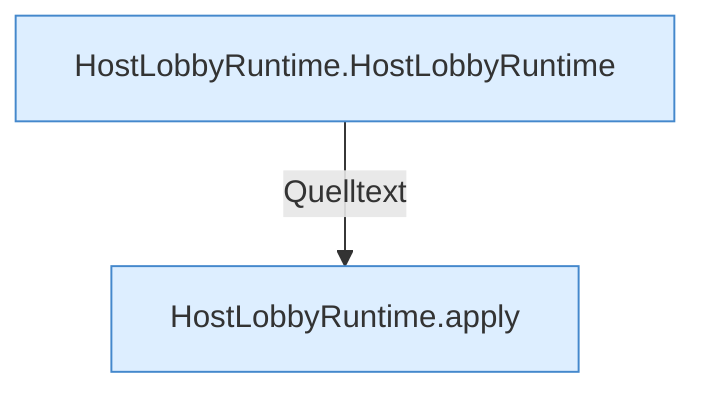

[[00 Start]] › [[Host-Betrieb]] › [[Host-Minimieren]] › [[HostLobbyRuntime]]

# HostLobbyRuntime

```mermaid
flowchart TD
  n1["HostLobbyRuntime.HostLobbyRuntime"]:::internal-link
  n2["HostLobbyRuntime.apply"]:::internal-link
  n1 -->|"Quelltext"| n2
  classDef internal-link fill:#ddeeff,stroke:#4488cc
  classDef befund fill:#f88
```

