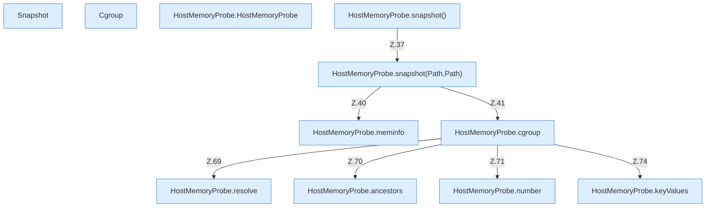

[[00 Start]] › [[Host-Betrieb]] › [[Speicher-Messung]] › [[HostMemoryProbe]]

# HostMemoryProbe

```mermaid
flowchart TD
  n1["Snapshot"]:::internal-link
  n2["Cgroup"]:::internal-link
  n3["HostMemoryProbe.HostMemoryProbe"]:::internal-link
  n4["HostMemoryProbe.snapshot()"]:::internal-link
  n5["HostMemoryProbe.snapshot(Path,Path)"]:::internal-link
  n6["HostMemoryProbe.meminfo"]:::internal-link
  n7["HostMemoryProbe.cgroup"]:::internal-link
  n8["HostMemoryProbe.resolve"]:::internal-link
  n9["HostMemoryProbe.ancestors"]:::internal-link
  n10["HostMemoryProbe.number"]:::internal-link
  n11["HostMemoryProbe.keyValues"]:::internal-link
  n4 -->|"Z.37"| n5
  n5 -->|"Z.40"| n6
  n5 -->|"Z.41"| n7
  n7 -->|"Z.69"| n8
  n7 -->|"Z.70"| n9
  n7 -->|"Z.71"| n10
  n7 -->|"Z.74"| n11
  classDef internal-link fill:#ddeeff,stroke:#4488cc
  classDef befund fill:#f88
```

