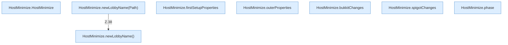

[[00 Start]] › [[Host-Betrieb]] › [[Host-Minimieren]] › [[HostMinimize]] › [[HostMinimize.Teil1]]

# HostMinimize.Teil1

```mermaid
flowchart TD
  n1["HostMinimize.HostMinimize"]:::internal-link
  n2["HostMinimize.newLobbyName()"]:::internal-link
  n3["HostMinimize.newLobbyName(Path)"]:::internal-link
  n4["HostMinimize.firstSetupProperties"]:::internal-link
  n5["HostMinimize.outerProperties"]:::internal-link
  n6["HostMinimize.bukkitChanges"]:::internal-link
  n7["HostMinimize.spigotChanges"]:::internal-link
  n8["HostMinimize.phase"]:::internal-link
  n3 -->|"Z.38"| n2
  classDef internal-link fill:#ddeeff,stroke:#4488cc
  classDef befund fill:#f88
```

