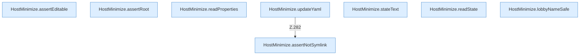

[[00 Start]] › [[Host-Betrieb]] › [[Host-Minimieren]] › [[HostMinimize]] › [[HostMinimize.Teil3]]

# HostMinimize.Teil3

```mermaid
flowchart TD
  n1["HostMinimize.assertEditable"]:::internal-link
  n2["HostMinimize.assertRoot"]:::internal-link
  n3["HostMinimize.readProperties"]:::internal-link
  n4["HostMinimize.updateYaml"]:::internal-link
  n5["HostMinimize.assertNotSymlink"]:::internal-link
  n6["HostMinimize.stateText"]:::internal-link
  n7["HostMinimize.readState"]:::internal-link
  n8["HostMinimize.lobbyNameSafe"]:::internal-link
  n4 -->|"Z.282"| n5
  classDef internal-link fill:#ddeeff,stroke:#4488cc
  classDef befund fill:#f88
```

