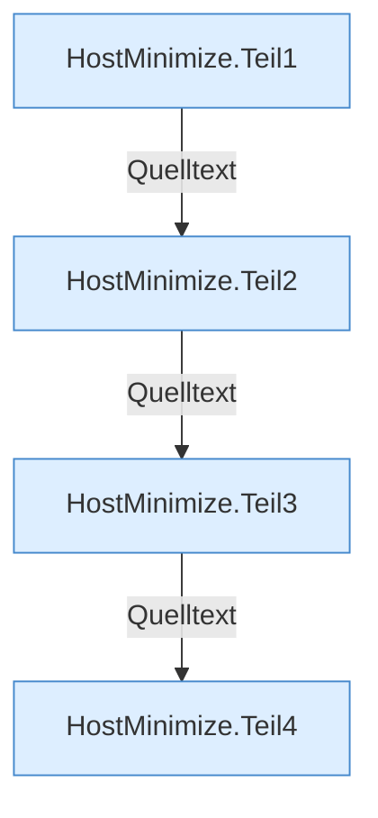

[[00 Start]] › [[Host-Betrieb]] › [[Host-Minimieren]] › [[HostMinimize]]

# HostMinimize

```mermaid
flowchart TD
  n1["HostMinimize.Teil1"]:::internal-link
  n2["HostMinimize.Teil2"]:::internal-link
  n3["HostMinimize.Teil3"]:::internal-link
  n4["HostMinimize.Teil4"]:::internal-link
  n1 -->|"Quelltext"| n2
  n2 -->|"Quelltext"| n3
  n3 -->|"Quelltext"| n4
  classDef internal-link fill:#ddeeff,stroke:#4488cc
  classDef befund fill:#f88
```

