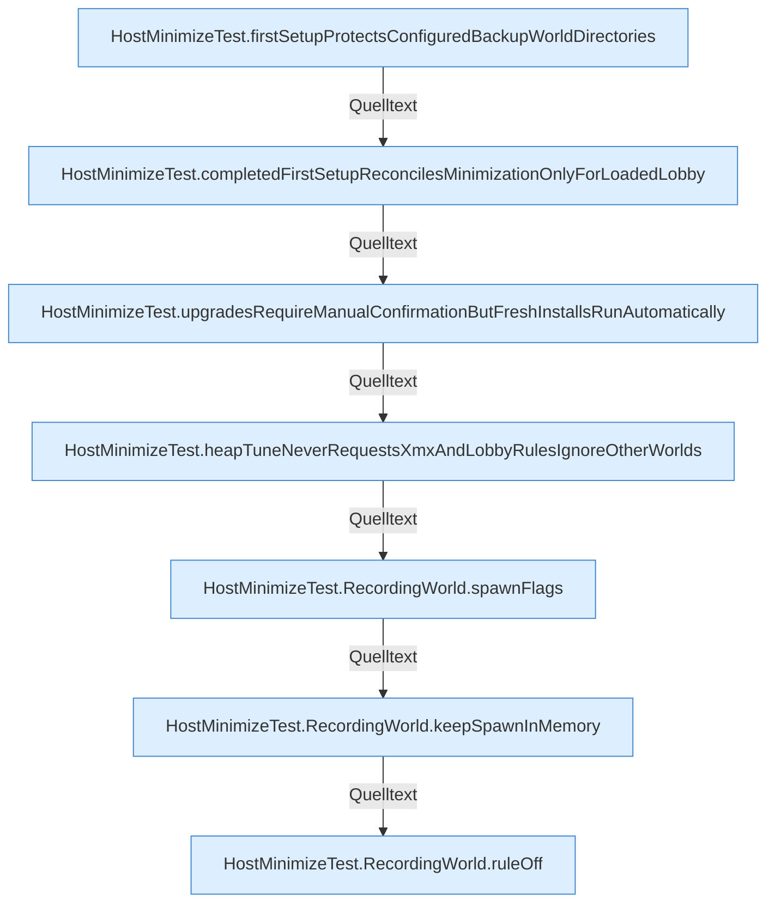

[[00 Start]] › [[Tests]] › [[HostMinimizeTest]] › [[HostMinimizeTest.Teil2]]

# HostMinimizeTest.Teil2

```mermaid
flowchart TD
  n1["HostMinimizeTest.firstSetupProtectsConfiguredBackupWorldDirectories"]:::internal-link
  n2["HostMinimizeTest.completedFirstSetupReconcilesMinimizationOnlyForLoadedLobby"]:::internal-link
  n3["HostMinimizeTest.upgradesRequireManualConfirmationButFreshInstallsRunAutomatically"]:::internal-link
  n4["HostMinimizeTest.heapTuneNeverRequestsXmxAndLobbyRulesIgnoreOtherWorlds"]:::internal-link
  n5["HostMinimizeTest.RecordingWorld.spawnFlags"]:::internal-link
  n6["HostMinimizeTest.RecordingWorld.keepSpawnInMemory"]:::internal-link
  n7["HostMinimizeTest.RecordingWorld.ruleOff"]:::internal-link
  n1 -->|"Quelltext"| n2
  n2 -->|"Quelltext"| n3
  n3 -->|"Quelltext"| n4
  n4 -->|"Quelltext"| n5
  n5 -->|"Quelltext"| n6
  n6 -->|"Quelltext"| n7
  classDef internal-link fill:#ddeeff,stroke:#4488cc
  classDef befund fill:#f88
```

