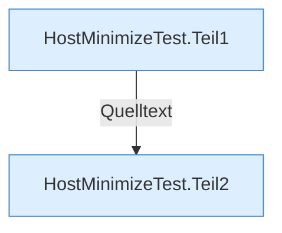

[[00 Start]] › [[Tests]] › [[HostMinimizeTest]]

# HostMinimizeTest

```mermaid
flowchart TD
  n1["HostMinimizeTest.Teil1"]:::internal-link
  n2["HostMinimizeTest.Teil2"]:::internal-link
  n1 -->|"Quelltext"| n2
  classDef internal-link fill:#ddeeff,stroke:#4488cc
  classDef befund fill:#f88
```

