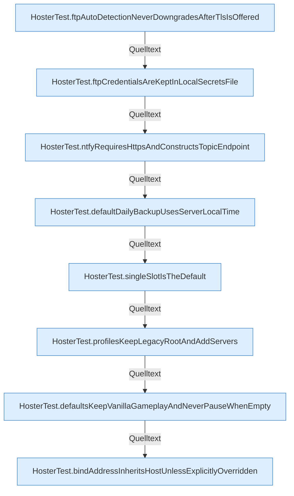

[[00 Start]] › [[Tests]] › [[HosterTest]] › [[HosterTest.Teil1]]

# HosterTest.Teil1

```mermaid
flowchart TD
  n1["HosterTest.ftpAutoDetectionNeverDowngradesAfterTlsIsOffered"]:::internal-link
  n2["HosterTest.ftpCredentialsAreKeptInLocalSecretsFile"]:::internal-link
  n3["HosterTest.ntfyRequiresHttpsAndConstructsTopicEndpoint"]:::internal-link
  n4["HosterTest.defaultDailyBackupUsesServerLocalTime"]:::internal-link
  n5["HosterTest.singleSlotIsTheDefault"]:::internal-link
  n6["HosterTest.profilesKeepLegacyRootAndAddServers"]:::internal-link
  n7["HosterTest.defaultsKeepVanillaGameplayAndNeverPauseWhenEmpty"]:::internal-link
  n8["HosterTest.bindAddressInheritsHostUnlessExplicitlyOverridden"]:::internal-link
  n1 -->|"Quelltext"| n2
  n2 -->|"Quelltext"| n3
  n3 -->|"Quelltext"| n4
  n4 -->|"Quelltext"| n5
  n5 -->|"Quelltext"| n6
  n6 -->|"Quelltext"| n7
  n7 -->|"Quelltext"| n8
  classDef internal-link fill:#ddeeff,stroke:#4488cc
  classDef befund fill:#f88
```

