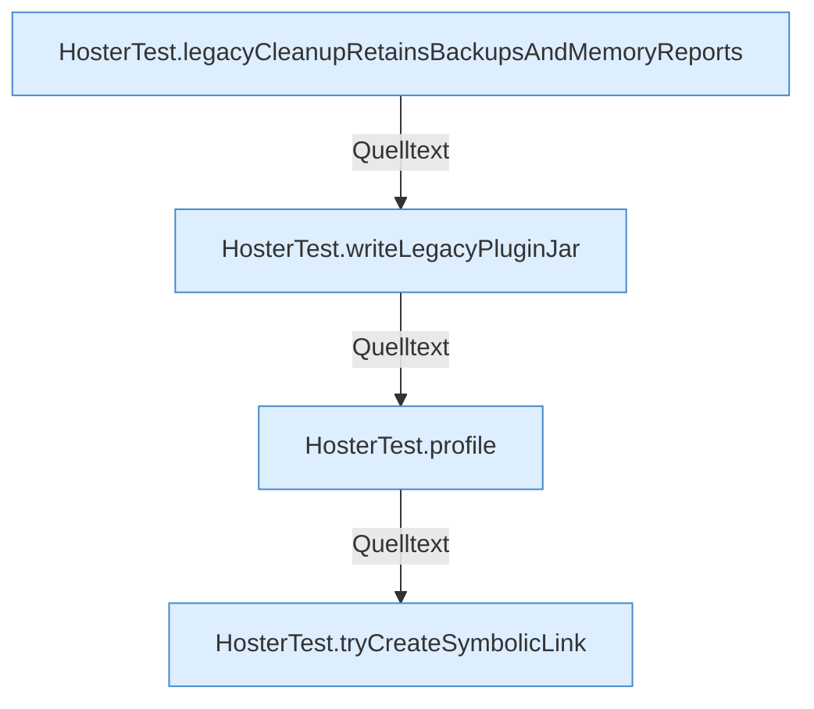

[[00 Start]] › [[Tests]] › [[HosterTest]] › [[HosterTest.Teil5]]

# HosterTest.Teil5

```mermaid
flowchart TD
  n1["HosterTest.legacyCleanupRetainsBackupsAndMemoryReports"]:::internal-link
  n2["HosterTest.writeLegacyPluginJar"]:::internal-link
  n3["HosterTest.profile"]:::internal-link
  n4["HosterTest.tryCreateSymbolicLink"]:::internal-link
  n1 -->|"Quelltext"| n2
  n2 -->|"Quelltext"| n3
  n3 -->|"Quelltext"| n4
  classDef internal-link fill:#ddeeff,stroke:#4488cc
  classDef befund fill:#f88
```

