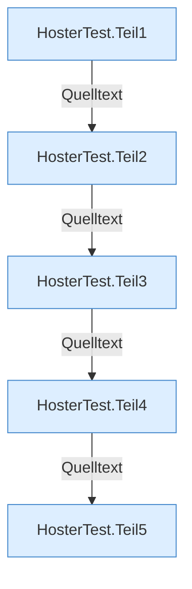

[[00 Start]] › [[Tests]] › [[HosterTest]]

# HosterTest

```mermaid
flowchart TD
  n1["HosterTest.Teil1"]:::internal-link
  n2["HosterTest.Teil2"]:::internal-link
  n3["HosterTest.Teil3"]:::internal-link
  n4["HosterTest.Teil4"]:::internal-link
  n5["HosterTest.Teil5"]:::internal-link
  n1 -->|"Quelltext"| n2
  n2 -->|"Quelltext"| n3
  n3 -->|"Quelltext"| n4
  n4 -->|"Quelltext"| n5
  classDef internal-link fill:#ddeeff,stroke:#4488cc
  classDef befund fill:#f88
```

