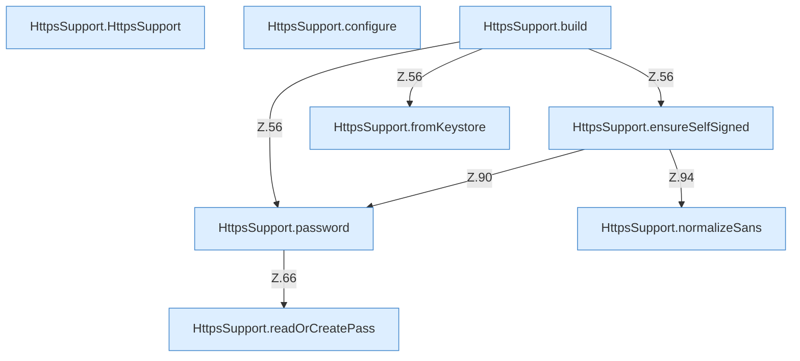

[[00 Start]] › [[Dashboard-HTTP]] › [[HTTP-Klassen]] › [[HttpsSupport]] › [[HttpsSupport.Teil1]]

# HttpsSupport.Teil1

```mermaid
flowchart TD
  n1["HttpsSupport.HttpsSupport"]:::internal-link
  n2["HttpsSupport.configure"]:::internal-link
  n3["HttpsSupport.build"]:::internal-link
  n4["HttpsSupport.password"]:::internal-link
  n5["HttpsSupport.readOrCreatePass"]:::internal-link
  n6["HttpsSupport.ensureSelfSigned"]:::internal-link
  n7["HttpsSupport.normalizeSans"]:::internal-link
  n8["HttpsSupport.fromKeystore"]:::internal-link
  n3 -->|"Z.56"| n8
  n3 -->|"Z.56"| n6
  n3 -->|"Z.56"| n4
  n4 -->|"Z.66"| n5
  n6 -->|"Z.90"| n4
  n6 -->|"Z.94"| n7
  classDef internal-link fill:#ddeeff,stroke:#4488cc
  classDef befund fill:#f88
```

