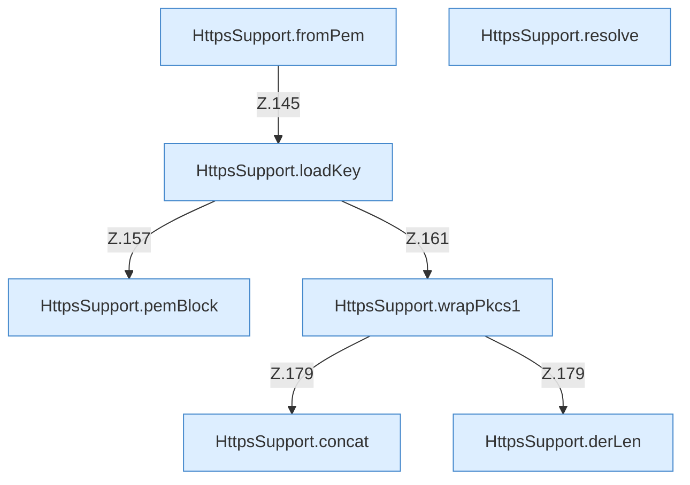

[[00 Start]] › [[Dashboard-HTTP]] › [[HTTP-Klassen]] › [[HttpsSupport]] › [[HttpsSupport.Teil2]]

# HttpsSupport.Teil2

```mermaid
flowchart TD
  n1["HttpsSupport.fromPem"]:::internal-link
  n2["HttpsSupport.loadKey"]:::internal-link
  n3["HttpsSupport.pemBlock"]:::internal-link
  n4["HttpsSupport.wrapPkcs1"]:::internal-link
  n5["HttpsSupport.derLen"]:::internal-link
  n6["HttpsSupport.concat"]:::internal-link
  n7["HttpsSupport.resolve"]:::internal-link
  n1 -->|"Z.145"| n2
  n2 -->|"Z.157"| n3
  n2 -->|"Z.161"| n4
  n4 -->|"Z.179"| n6
  n4 -->|"Z.179"| n5
  classDef internal-link fill:#ddeeff,stroke:#4488cc
  classDef befund fill:#f88
```

