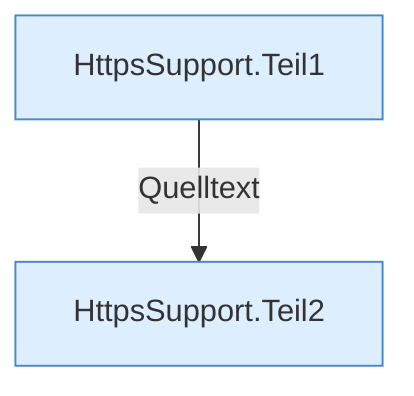

[[00 Start]] › [[Dashboard-HTTP]] › [[HTTP-Klassen]] › [[HttpsSupport]]

# HttpsSupport

```mermaid
flowchart TD
  n1["HttpsSupport.Teil1"]:::internal-link
  n2["HttpsSupport.Teil2"]:::internal-link
  n1 -->|"Quelltext"| n2
  classDef internal-link fill:#ddeeff,stroke:#4488cc
  classDef befund fill:#f88
```

