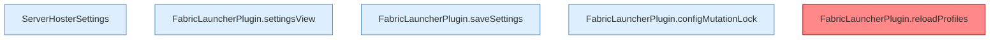

[[00 Start]] › [[Plugin-Kern]] › [[Konfiguration]]

# Konfiguration

```mermaid
flowchart TD
  n1["ServerHosterSettings"]:::internal-link
  n2["FabricLauncherPlugin.settingsView"]:::internal-link
  n3["FabricLauncherPlugin.saveSettings"]:::internal-link
  n4["FabricLauncherPlugin.configMutationLock"]:::internal-link
  n5["FabricLauncherPlugin.reloadProfiles"]:::internal-link
  classDef internal-link fill:#ddeeff,stroke:#4488cc
  classDef befund fill:#f88
  style n5 fill:#f88,stroke:#900
```

- `reloadProfiles` behält nur `configured.getFirst()`.
- Record `ServerHosterSettings` prüft Restart- und FTP-Grenzen.
