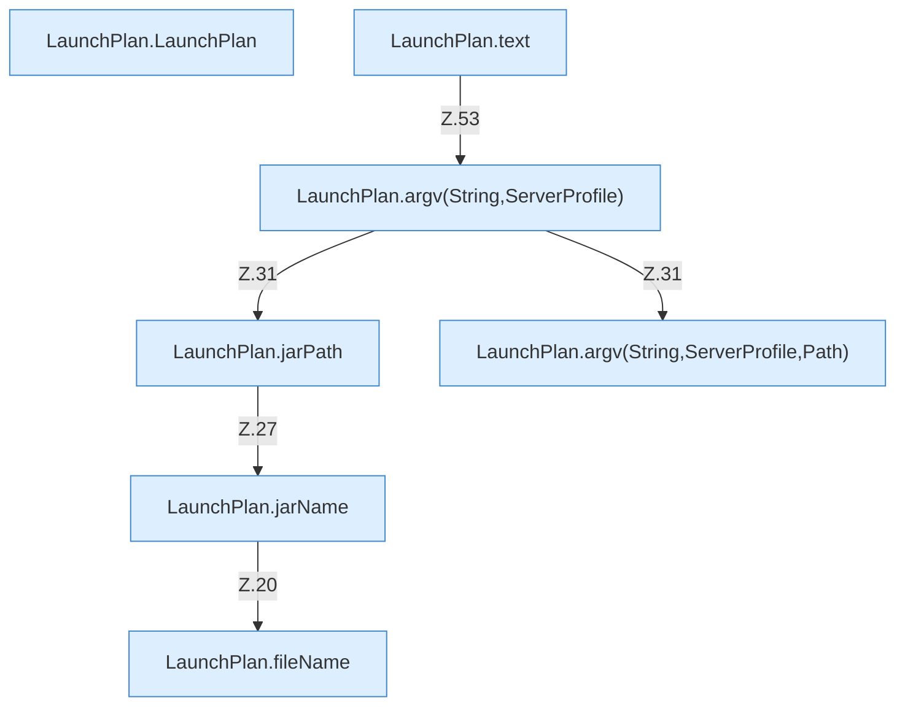

[[00 Start]] › [[Server-Anlage]] › [[Startplan]] › [[LaunchPlan]]

# LaunchPlan

```mermaid
flowchart TD
  n1["LaunchPlan.LaunchPlan"]:::internal-link
  n2["LaunchPlan.jarName"]:::internal-link
  n3["LaunchPlan.jarPath"]:::internal-link
  n4["LaunchPlan.argv(String,ServerProfile)"]:::internal-link
  n5["LaunchPlan.argv(String,ServerProfile,Path)"]:::internal-link
  n6["LaunchPlan.text"]:::internal-link
  n7["LaunchPlan.fileName"]:::internal-link
  n2 -->|"Z.20"| n7
  n3 -->|"Z.27"| n2
  n4 -->|"Z.31"| n5
  n4 -->|"Z.31"| n3
  n6 -->|"Z.53"| n4
  classDef internal-link fill:#ddeeff,stroke:#4488cc
  classDef befund fill:#f88
```

