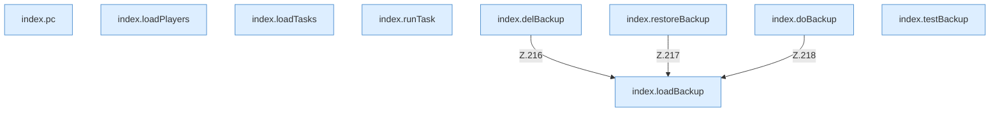

[[00 Start]] › [[Dashboard-UI]] › [[Legacy-Altlast]]

# Legacy-Altlast

```mermaid
flowchart TD
  n1["index.pc"]:::internal-link
  n2["index.loadPlayers"]:::internal-link
  n3["index.loadTasks"]:::internal-link
  n4["index.runTask"]:::internal-link
  n5["index.loadBackup"]:::internal-link
  n6["index.delBackup"]:::internal-link
  n7["index.restoreBackup"]:::internal-link
  n8["index.doBackup"]:::internal-link
  n9["index.testBackup"]:::internal-link
  n6 -->|"Z.216"| n5
  n7 -->|"Z.217"| n5
  n8 -->|"Z.218"| n5
  classDef internal-link fill:#ddeeff,stroke:#4488cc
  classDef befund fill:#f88
```

