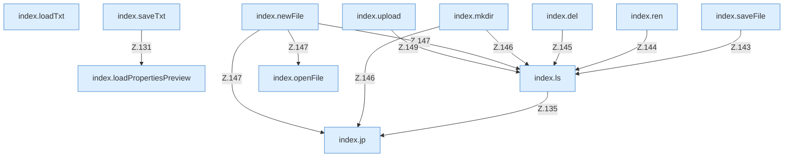

[[00 Start]] › [[Dashboard-UI]] › [[Legacy-Dateien]]

# Legacy-Dateien

```mermaid
flowchart TD
  n1["index.loadTxt"]:::internal-link
  n2["index.saveTxt"]:::internal-link
  n3["index.loadPropertiesPreview"]:::internal-link
  n4["index.jp"]:::internal-link
  n5["index.ls"]:::internal-link
  n6["index.openFile"]:::internal-link
  n7["index.saveFile"]:::internal-link
  n8["index.ren"]:::internal-link
  n9["index.del"]:::internal-link
  n10["index.mkdir"]:::internal-link
  n11["index.newFile"]:::internal-link
  n12["index.upload"]:::internal-link
  n2 -->|"Z.131"| n3
  n5 -->|"Z.135"| n4
  n7 -->|"Z.143"| n5
  n8 -->|"Z.144"| n5
  n9 -->|"Z.145"| n5
  n10 -->|"Z.146"| n4
  n10 -->|"Z.146"| n5
  n11 -->|"Z.147"| n4
  n11 -->|"Z.147"| n5
  n11 -->|"Z.147"| n6
  n12 -->|"Z.149"| n5
  classDef internal-link fill:#ddeeff,stroke:#4488cc
  classDef befund fill:#f88
```

