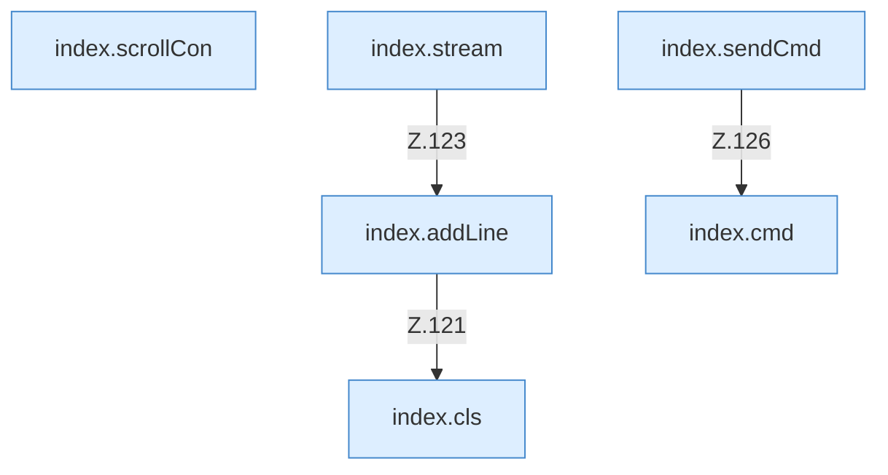

[[00 Start]] › [[Dashboard-UI]] › [[Legacy-Konsole]]

# Legacy-Konsole

```mermaid
flowchart TD
  n1["index.cls"]:::internal-link
  n2["index.addLine"]:::internal-link
  n3["index.scrollCon"]:::internal-link
  n4["index.stream"]:::internal-link
  n5["index.cmd"]:::internal-link
  n6["index.sendCmd"]:::internal-link
  n2 -->|"Z.121"| n1
  n4 -->|"Z.123"| n2
  n6 -->|"Z.126"| n5
  classDef internal-link fill:#ddeeff,stroke:#4488cc
  classDef befund fill:#f88
```

