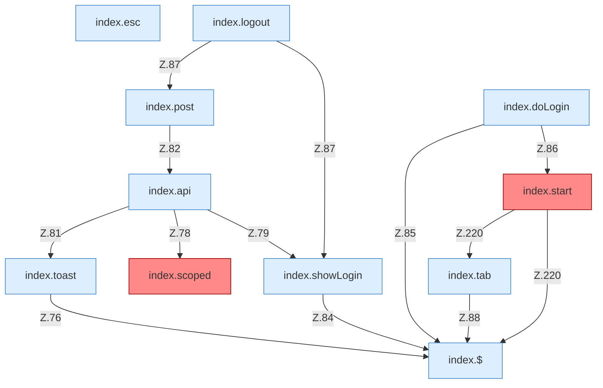

[[00 Start]] › [[Dashboard-UI]] › [[Legacy-Sitzung]]

# Legacy-Sitzung

```mermaid
flowchart TD
  n1["index.$"]:::internal-link
  n2["index.toast"]:::internal-link
  n3["index.scoped"]:::internal-link
  n4["index.api"]:::internal-link
  n5["index.post"]:::internal-link
  n6["index.esc"]:::internal-link
  n7["index.showLogin"]:::internal-link
  n8["index.doLogin"]:::internal-link
  n9["index.logout"]:::internal-link
  n10["index.tab"]:::internal-link
  n11["index.start"]:::internal-link
  n2 -->|"Z.76"| n1
  n4 -->|"Z.78"| n3
  n4 -->|"Z.79"| n7
  n4 -->|"Z.81"| n2
  n5 -->|"Z.82"| n4
  n7 -->|"Z.84"| n1
  n8 -->|"Z.85"| n1
  n8 -->|"Z.86"| n11
  n9 -->|"Z.87"| n5
  n9 -->|"Z.87"| n7
  n10 -->|"Z.88"| n1
  n11 -->|"Z.220"| n1
  n11 -->|"Z.220"| n10
  classDef internal-link fill:#ddeeff,stroke:#4488cc
  classDef befund fill:#f88
  style n3 fill:#f88,stroke:#900
  style n11 fill:#f88,stroke:#900
```

