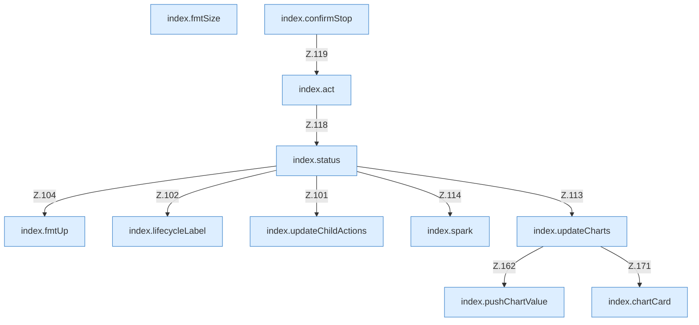

[[00 Start]] › [[Dashboard-UI]] › [[Legacy-Status]]

# Legacy-Status

```mermaid
flowchart TD
  n1["index.fmtUp"]:::internal-link
  n2["index.fmtSize"]:::internal-link
  n3["index.lifecycleLabel"]:::internal-link
  n4["index.updateChildActions"]:::internal-link
  n5["index.status"]:::internal-link
  n6["index.act"]:::internal-link
  n7["index.confirmStop"]:::internal-link
  n8["index.spark"]:::internal-link
  n9["index.pushChartValue"]:::internal-link
  n10["index.updateCharts"]:::internal-link
  n11["index.chartCard"]:::internal-link
  n5 -->|"Z.101"| n4
  n5 -->|"Z.102"| n3
  n5 -->|"Z.104"| n1
  n5 -->|"Z.113"| n10
  n5 -->|"Z.114"| n8
  n6 -->|"Z.118"| n5
  n7 -->|"Z.119"| n6
  n10 -->|"Z.162"| n9
  n10 -->|"Z.171"| n11
  classDef internal-link fill:#ddeeff,stroke:#4488cc
  classDef befund fill:#f88
```

