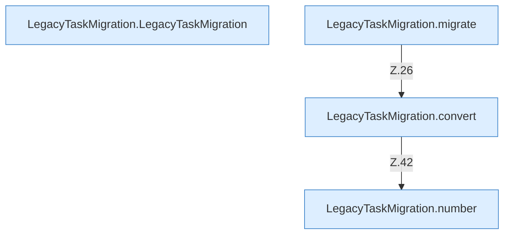

[[00 Start]] › [[Zeitplaene]] › [[Plan-Klassen]] › [[LegacyTaskMigration]]

# LegacyTaskMigration

```mermaid
flowchart TD
  n1["LegacyTaskMigration.LegacyTaskMigration"]:::internal-link
  n2["LegacyTaskMigration.migrate"]:::internal-link
  n3["LegacyTaskMigration.convert"]:::internal-link
  n4["LegacyTaskMigration.number"]:::internal-link
  n2 -->|"Z.26"| n3
  n3 -->|"Z.42"| n4
  classDef internal-link fill:#ddeeff,stroke:#4488cc
  classDef befund fill:#f88
```

