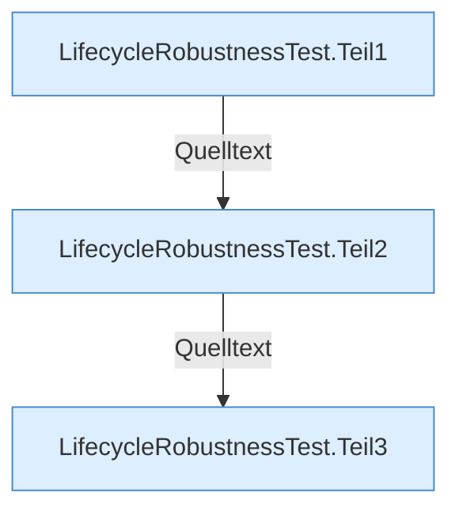

[[00 Start]] › [[Tests]] › [[LifecycleRobustnessTest]]

# LifecycleRobustnessTest

```mermaid
flowchart TD
  n1["LifecycleRobustnessTest.Teil1"]:::internal-link
  n2["LifecycleRobustnessTest.Teil2"]:::internal-link
  n3["LifecycleRobustnessTest.Teil3"]:::internal-link
  n1 -->|"Quelltext"| n2
  n2 -->|"Quelltext"| n3
  classDef internal-link fill:#ddeeff,stroke:#4488cc
  classDef befund fill:#f88
```

