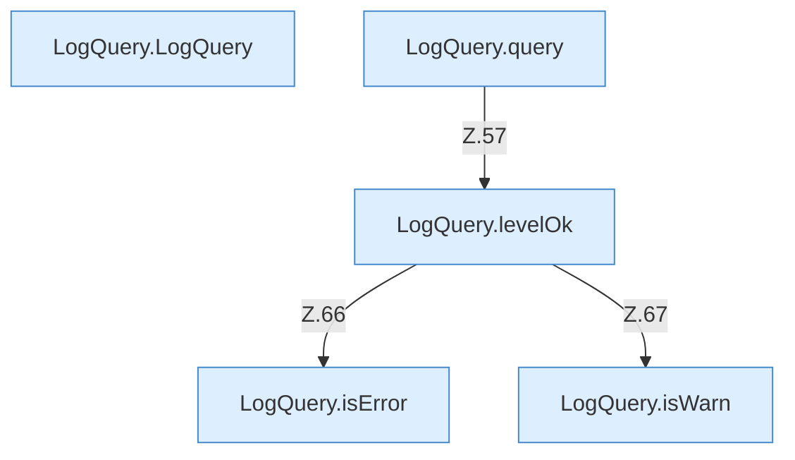

[[00 Start]] › [[Dashboard-HTTP]] › [[HTTP-Klassen]] › [[LogQuery]]

# LogQuery

```mermaid
flowchart TD
  n1["LogQuery.LogQuery"]:::internal-link
  n2["LogQuery.query"]:::internal-link
  n3["LogQuery.levelOk"]:::internal-link
  n4["LogQuery.isError"]:::internal-link
  n5["LogQuery.isWarn"]:::internal-link
  n2 -->|"Z.57"| n3
  n3 -->|"Z.66"| n4
  n3 -->|"Z.67"| n5
  classDef internal-link fill:#ddeeff,stroke:#4488cc
  classDef befund fill:#f88
```

