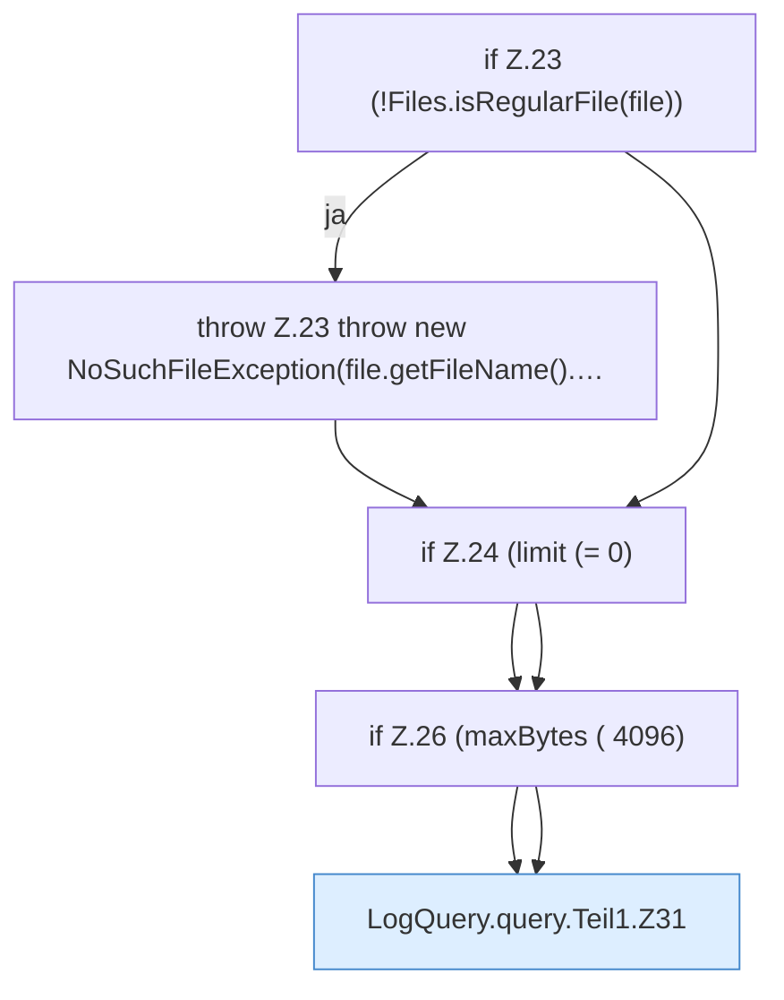

[[00 Start]] › [[Dashboard-HTTP]] › [[HTTP-Klassen]] › [[LogQuery]] › [[LogQuery.query]] › [[LogQuery.query.Teil1]]

# LogQuery.query.Teil1

```mermaid
flowchart TD
  n1["if Z.23 (!Files.isRegularFile(file))"]
  n2["throw Z.23 throw new NoSuchFileException(file.getFileName().…"]
  n3["if Z.24 (limit (= 0)"]
  n4["if Z.26 (maxBytes ( 4096)"]
  n5["LogQuery.query.Teil1.Z31"]:::internal-link
  n1 -->|"ja"| n2
  n2 --> n3
  n1 --> n3
  n3 --> n4
  n3 --> n4
  n4 --> n5
  n4 --> n5
  classDef internal-link fill:#ddeeff,stroke:#4488cc
  classDef befund fill:#f88
```

- Fortsetzung von `LogQuery.query`, Quellreihenfolge.
