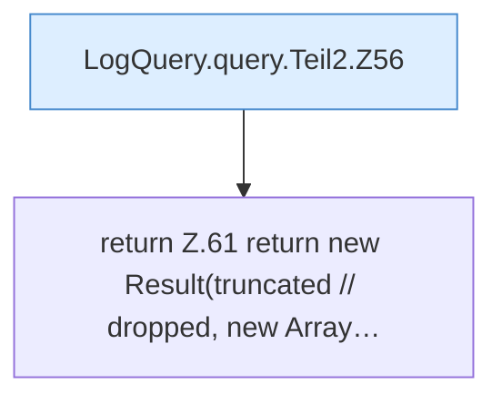

[[00 Start]] › [[Dashboard-HTTP]] › [[HTTP-Klassen]] › [[LogQuery]] › [[LogQuery.query]] › [[LogQuery.query.Teil2]]

# LogQuery.query.Teil2

```mermaid
flowchart TD
  n1["LogQuery.query.Teil2.Z56"]:::internal-link
  n2["return Z.61 return new Result(truncated // dropped, new Array…"]
  n1 --> n2
  classDef internal-link fill:#ddeeff,stroke:#4488cc
  classDef befund fill:#f88
```

- Fortsetzung von `LogQuery.query`, Quellreihenfolge.
