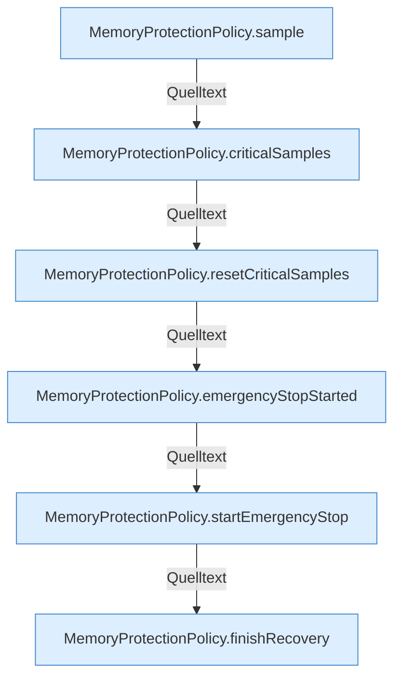
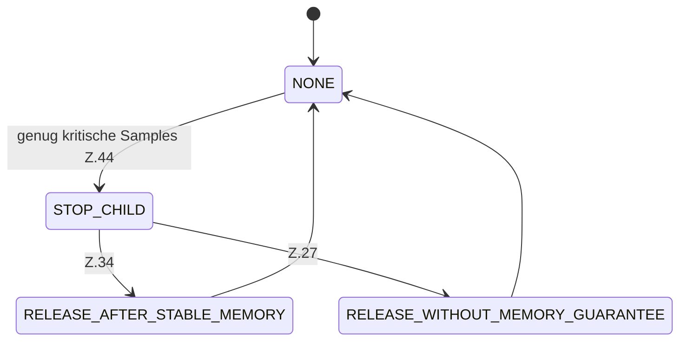

[[00 Start]] › [[Host-Betrieb]] › [[Speicher-Messung]] › [[MemoryProtectionPolicy]]

# MemoryProtectionPolicy

```mermaid
flowchart TD
  n1["MemoryProtectionPolicy.sample"]:::internal-link
  n2["MemoryProtectionPolicy.criticalSamples"]:::internal-link
  n3["MemoryProtectionPolicy.resetCriticalSamples"]:::internal-link
  n4["MemoryProtectionPolicy.emergencyStopStarted"]:::internal-link
  n5["MemoryProtectionPolicy.startEmergencyStop"]:::internal-link
  n6["MemoryProtectionPolicy.finishRecovery"]:::internal-link
  n1 -->|"Quelltext"| n2
  n2 -->|"Quelltext"| n3
  n3 -->|"Quelltext"| n4
  n4 -->|"Quelltext"| n5
  n5 -->|"Quelltext"| n6
  classDef internal-link fill:#ddeeff,stroke:#4488cc
  classDef befund fill:#f88
```

```mermaid
stateDiagram-v2
  [*] --> NONE
  NONE --> STOP_CHILD: genug kritische Samples Z.44
  STOP_CHILD --> RELEASE_AFTER_STABLE_MEMORY: Z.34
  STOP_CHILD --> RELEASE_WITHOUT_MEMORY_GUARANTEE: Z.27
  RELEASE_AFTER_STABLE_MEMORY --> NONE
  RELEASE_WITHOUT_MEMORY_GUARANTEE --> NONE
```

