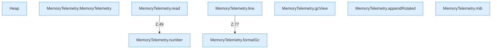

[[00 Start]] › [[Host-Betrieb]] › [[Speicher-Messung]] › [[MemoryTelemetry]]

# MemoryTelemetry

```mermaid
flowchart TD
  n1["Heap"]:::internal-link
  n2["MemoryTelemetry.MemoryTelemetry"]:::internal-link
  n3["MemoryTelemetry.read"]:::internal-link
  n4["MemoryTelemetry.line"]:::internal-link
  n5["MemoryTelemetry.gcView"]:::internal-link
  n6["MemoryTelemetry.appendRotated"]:::internal-link
  n7["MemoryTelemetry.formatGc"]:::internal-link
  n8["MemoryTelemetry.mib"]:::internal-link
  n9["MemoryTelemetry.number"]:::internal-link
  n3 -->|"Z.49"| n9
  n4 -->|"Z.77"| n7
  classDef internal-link fill:#ddeeff,stroke:#4488cc
  classDef befund fill:#f88
```

