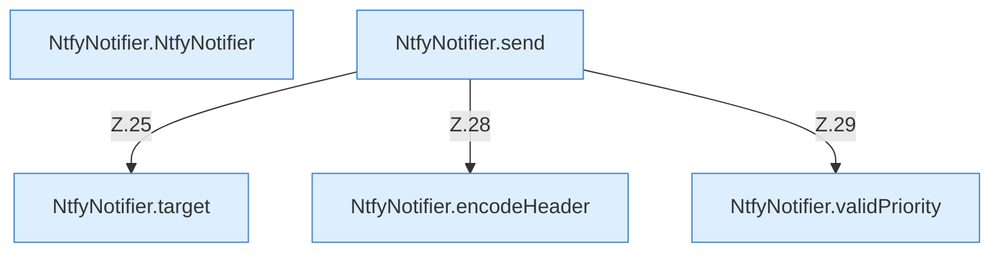

[[00 Start]] › [[Plugin-Kern]] › [[Benachrichtigung]] › [[NtfyNotifier]]

# NtfyNotifier

```mermaid
flowchart TD
  n1["NtfyNotifier.NtfyNotifier"]:::internal-link
  n2["NtfyNotifier.send"]:::internal-link
  n3["NtfyNotifier.target"]:::internal-link
  n4["NtfyNotifier.encodeHeader"]:::internal-link
  n5["NtfyNotifier.validPriority"]:::internal-link
  n2 -->|"Z.25"| n3
  n2 -->|"Z.28"| n4
  n2 -->|"Z.29"| n5
  classDef internal-link fill:#ddeeff,stroke:#4488cc
  classDef befund fill:#f88
```

