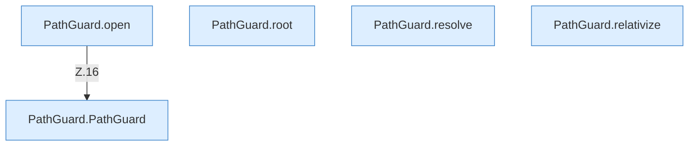

[[00 Start]] › [[Server-Anlage]] › [[Startplan]] › [[PathGuard]]

# PathGuard

```mermaid
flowchart TD
  n1["PathGuard.PathGuard"]:::internal-link
  n2["PathGuard.open"]:::internal-link
  n3["PathGuard.root"]:::internal-link
  n4["PathGuard.resolve"]:::internal-link
  n5["PathGuard.relativize"]:::internal-link
  n2 -->|"Z.16"| n1
  classDef internal-link fill:#ddeeff,stroke:#4488cc
  classDef befund fill:#f88
```

