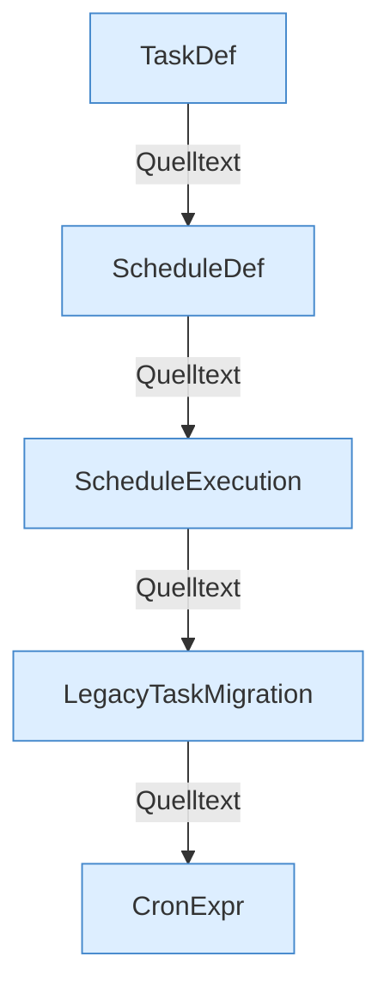

[[00 Start]] › [[Zeitplaene]] › [[Plan-Klassen]]

# Plan-Klassen

```mermaid
flowchart TD
  n1["TaskDef"]:::internal-link
  n2["ScheduleDef"]:::internal-link
  n3["ScheduleExecution"]:::internal-link
  n4["LegacyTaskMigration"]:::internal-link
  n5["CronExpr"]:::internal-link
  n1 -->|"Quelltext"| n2
  n2 -->|"Quelltext"| n3
  n3 -->|"Quelltext"| n4
  n4 -->|"Quelltext"| n5
  classDef internal-link fill:#ddeeff,stroke:#4488cc
  classDef befund fill:#f88
```

