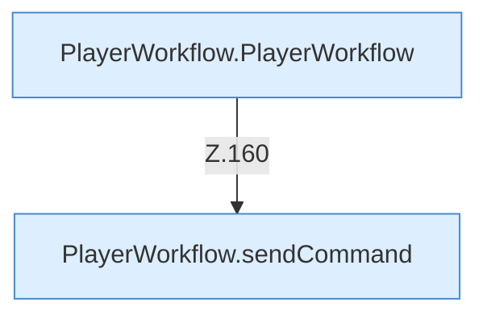

[[00 Start]] › [[Dashboard-UI]] › [[UI-Workflows]] › [[PlayerWorkflow]]

# PlayerWorkflow

```mermaid
flowchart TD
  n1["PlayerWorkflow.sendCommand"]:::internal-link
  n2["PlayerWorkflow.PlayerWorkflow"]:::internal-link
  n2 -->|"Z.160"| n1
  classDef internal-link fill:#ddeeff,stroke:#4488cc
  classDef befund fill:#f88
```

