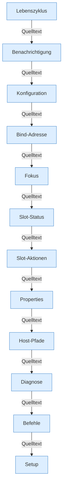

[[00 Start]] › [[Plugin-Kern]]

# Plugin-Kern

```mermaid
flowchart TD
  n1["Lebenszyklus"]:::internal-link
  n2["Benachrichtigung"]:::internal-link
  n3["Konfiguration"]:::internal-link
  n4["Bind-Adresse"]:::internal-link
  n5["Fokus"]:::internal-link
  n6["Slot-Status"]:::internal-link
  n7["Slot-Aktionen"]:::internal-link
  n8["Properties"]:::internal-link
  n9["Host-Pfade"]:::internal-link
  n10["Diagnose"]:::internal-link
  n11["Befehle"]:::internal-link
  n12["Setup"]:::internal-link
  n1 -->|"Quelltext"| n2
  n2 -->|"Quelltext"| n3
  n3 -->|"Quelltext"| n4
  n4 -->|"Quelltext"| n5
  n5 -->|"Quelltext"| n6
  n6 -->|"Quelltext"| n7
  n7 -->|"Quelltext"| n8
  n8 -->|"Quelltext"| n9
  n9 -->|"Quelltext"| n10
  n10 -->|"Quelltext"| n11
  n11 -->|"Quelltext"| n12
  classDef internal-link fill:#ddeeff,stroke:#4488cc
  classDef befund fill:#f88
```

- `FabricLauncherPlugin`: Lebenszyklus, `/child`, Config, ein Fokus-Slot.
