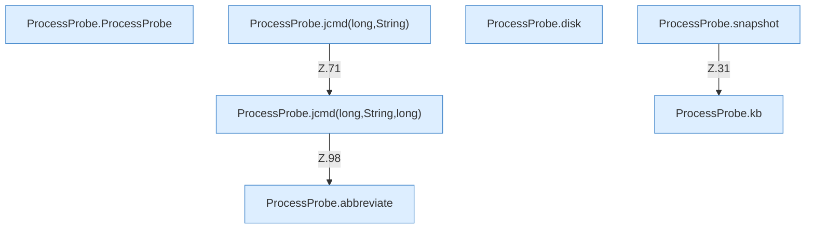

[[00 Start]] › [[Host-Betrieb]] › [[Speicher-Messung]] › [[ProcessProbe]]

# ProcessProbe

```mermaid
flowchart TD
  n1["ProcessProbe.ProcessProbe"]:::internal-link
  n2["ProcessProbe.snapshot"]:::internal-link
  n3["ProcessProbe.disk"]:::internal-link
  n4["ProcessProbe.jcmd(long,String)"]:::internal-link
  n5["ProcessProbe.jcmd(long,String,long)"]:::internal-link
  n6["ProcessProbe.kb"]:::internal-link
  n7["ProcessProbe.abbreviate"]:::internal-link
  n2 -->|"Z.31"| n6
  n4 -->|"Z.71"| n5
  n5 -->|"Z.98"| n7
  classDef internal-link fill:#ddeeff,stroke:#4488cc
  classDef befund fill:#f88
```

