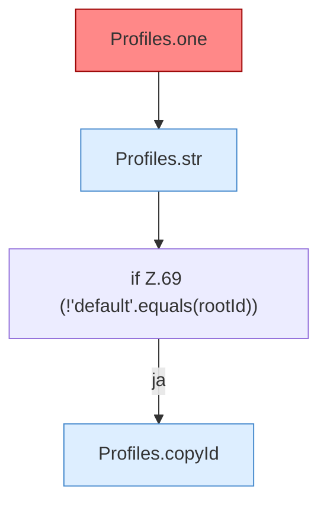

[[00 Start]] › [[Server-Anlage]] › [[Profile]] › [[Profiles]] › [[Profiles.load]] › [[Profiles.load.Teil1]]

# Profiles.load.Teil1

```mermaid
flowchart TD
  n1["Profiles.one"]:::internal-link
  n2["Profiles.str"]:::internal-link
  n3["if Z.69 (!'default'.equals(rootId))"]
  n4["Profiles.copyId"]:::internal-link
  n1 --> n2
  n3 -->|"ja"| n4
  n2 --> n3
  classDef internal-link fill:#ddeeff,stroke:#4488cc
  classDef befund fill:#f88
  style n1 fill:#f88,stroke:#900
```

- Fortsetzung von `Profiles.load`, Quellreihenfolge.
