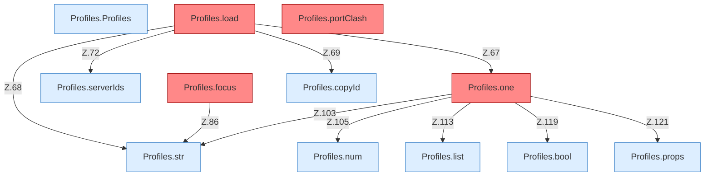

[[00 Start]] › [[Server-Anlage]] › [[Profile]] › [[Profiles]]

# Profiles

```mermaid
flowchart TD
  n1["Profiles.Profiles"]:::internal-link
  n2["Profiles.load"]:::internal-link
  n3["Profiles.portClash"]:::internal-link
  n4["Profiles.focus"]:::internal-link
  n5["Profiles.serverIds"]:::internal-link
  n6["Profiles.one"]:::internal-link
  n7["Profiles.copyId"]:::internal-link
  n8["Profiles.props"]:::internal-link
  n9["Profiles.str"]:::internal-link
  n10["Profiles.num"]:::internal-link
  n11["Profiles.bool"]:::internal-link
  n12["Profiles.list"]:::internal-link
  n2 -->|"Z.67"| n6
  n2 -->|"Z.68"| n9
  n2 -->|"Z.69"| n7
  n2 -->|"Z.72"| n5
  n4 -->|"Z.86"| n9
  n6 -->|"Z.103"| n9
  n6 -->|"Z.105"| n10
  n6 -->|"Z.113"| n12
  n6 -->|"Z.119"| n11
  n6 -->|"Z.121"| n8
  classDef internal-link fill:#ddeeff,stroke:#4488cc
  classDef befund fill:#f88
  style n2 fill:#f88,stroke:#900
  style n3 fill:#f88,stroke:#900
  style n4 fill:#f88,stroke:#900
  style n6 fill:#f88,stroke:#900
```

