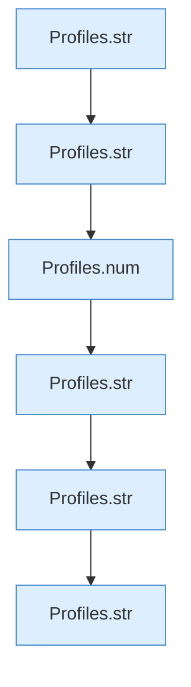

[[00 Start]] › [[Server-Anlage]] › [[Profile]] › [[Profiles]] › [[Profiles.one]] › [[Profiles.one.Teil1]]

# Profiles.one.Teil1

```mermaid
flowchart TD
  n1["Profiles.str"]:::internal-link
  n2["Profiles.str"]:::internal-link
  n3["Profiles.num"]:::internal-link
  n4["Profiles.str"]:::internal-link
  n5["Profiles.str"]:::internal-link
  n6["Profiles.str"]:::internal-link
  n1 --> n2
  n2 --> n3
  n3 --> n4
  n4 --> n5
  n5 --> n6
  classDef internal-link fill:#ddeeff,stroke:#4488cc
  classDef befund fill:#f88
```

- Fortsetzung von `Profiles.one`, Quellreihenfolge.
