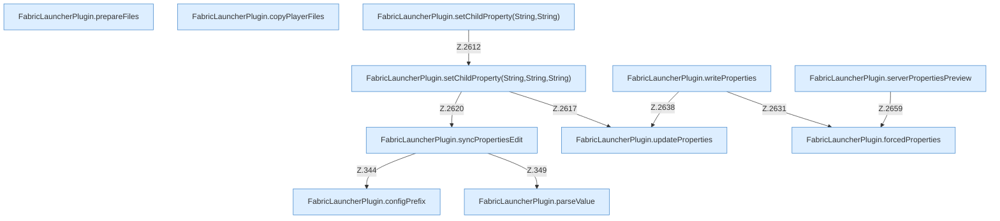

[[00 Start]] › [[Plugin-Kern]] › [[Properties]]

# Properties

```mermaid
flowchart TD
  n1["FabricLauncherPlugin.syncPropertiesEdit"]:::internal-link
  n2["FabricLauncherPlugin.configPrefix"]:::internal-link
  n3["FabricLauncherPlugin.prepareFiles"]:::internal-link
  n4["FabricLauncherPlugin.copyPlayerFiles"]:::internal-link
  n5["FabricLauncherPlugin.parseValue"]:::internal-link
  n6["FabricLauncherPlugin.setChildProperty(String,String)"]:::internal-link
  n7["FabricLauncherPlugin.setChildProperty(String,String,String)"]:::internal-link
  n8["FabricLauncherPlugin.updateProperties"]:::internal-link
  n9["FabricLauncherPlugin.writeProperties"]:::internal-link
  n10["FabricLauncherPlugin.forcedProperties"]:::internal-link
  n11["FabricLauncherPlugin.serverPropertiesPreview"]:::internal-link
  n1 -->|"Z.344"| n2
  n1 -->|"Z.349"| n5
  n6 -->|"Z.2612"| n7
  n7 -->|"Z.2617"| n8
  n7 -->|"Z.2620"| n1
  n9 -->|"Z.2631"| n10
  n9 -->|"Z.2638"| n8
  n11 -->|"Z.2659"| n10
  classDef internal-link fill:#ddeeff,stroke:#4488cc
  classDef befund fill:#f88
```

