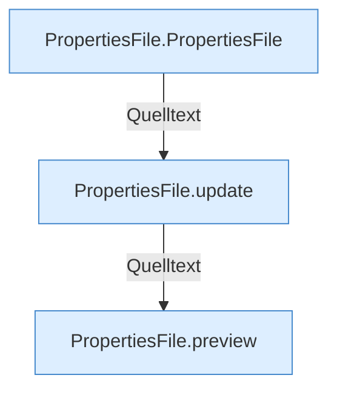

[[00 Start]] › [[Server-Anlage]] › [[Startplan]] › [[PropertiesFile]]

# PropertiesFile

```mermaid
flowchart TD
  n1["PropertiesFile.PropertiesFile"]:::internal-link
  n2["PropertiesFile.update"]:::internal-link
  n3["PropertiesFile.preview"]:::internal-link
  n1 -->|"Quelltext"| n2
  n2 -->|"Quelltext"| n3
  classDef internal-link fill:#ddeeff,stroke:#4488cc
  classDef befund fill:#f88
```

