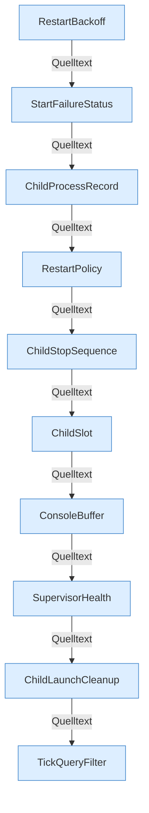

[[00 Start]] › [[Child-Prozess]] › [[Prozess-Bausteine]]

# Prozess-Bausteine

```mermaid
flowchart TD
  n1["RestartBackoff"]:::internal-link
  n2["StartFailureStatus"]:::internal-link
  n3["ChildProcessRecord"]:::internal-link
  n4["RestartPolicy"]:::internal-link
  n5["ChildStopSequence"]:::internal-link
  n6["ChildSlot"]:::internal-link
  n7["ConsoleBuffer"]:::internal-link
  n8["SupervisorHealth"]:::internal-link
  n9["ChildLaunchCleanup"]:::internal-link
  n10["TickQueryFilter"]:::internal-link
  n1 -->|"Quelltext"| n2
  n2 -->|"Quelltext"| n3
  n3 -->|"Quelltext"| n4
  n4 -->|"Quelltext"| n5
  n5 -->|"Quelltext"| n6
  n6 -->|"Quelltext"| n7
  n7 -->|"Quelltext"| n8
  n8 -->|"Quelltext"| n9
  n9 -->|"Quelltext"| n10
  classDef internal-link fill:#ddeeff,stroke:#4488cc
  classDef befund fill:#f88
```

- Slot, Prozessrecord, Stoppsequenz, Restart, Supervisor.
