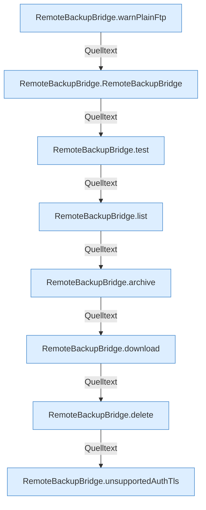

[[00 Start]] › [[Backup]] › [[Backup-Bruecken]] › [[RemoteBackupBridge]] › [[RemoteBackupBridge.Teil1]]

# RemoteBackupBridge.Teil1

```mermaid
flowchart TD
  n1["RemoteBackupBridge.warnPlainFtp"]:::internal-link
  n2["RemoteBackupBridge.RemoteBackupBridge"]:::internal-link
  n3["RemoteBackupBridge.test"]:::internal-link
  n4["RemoteBackupBridge.list"]:::internal-link
  n5["RemoteBackupBridge.archive"]:::internal-link
  n6["RemoteBackupBridge.download"]:::internal-link
  n7["RemoteBackupBridge.delete"]:::internal-link
  n8["RemoteBackupBridge.unsupportedAuthTls"]:::internal-link
  n1 -->|"Quelltext"| n2
  n2 -->|"Quelltext"| n3
  n3 -->|"Quelltext"| n4
  n4 -->|"Quelltext"| n5
  n5 -->|"Quelltext"| n6
  n6 -->|"Quelltext"| n7
  n7 -->|"Quelltext"| n8
  classDef internal-link fill:#ddeeff,stroke:#4488cc
  classDef befund fill:#f88
```

