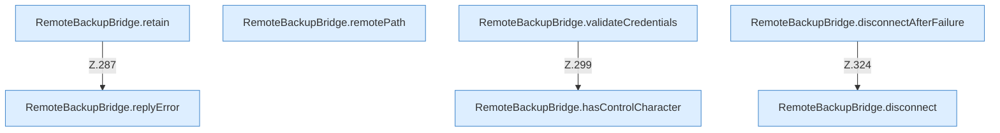

[[00 Start]] › [[Backup]] › [[Backup-Bruecken]] › [[RemoteBackupBridge]] › [[RemoteBackupBridge.Teil3]]

# RemoteBackupBridge.Teil3

```mermaid
flowchart TD
  n1["RemoteBackupBridge.retain"]:::internal-link
  n2["RemoteBackupBridge.remotePath"]:::internal-link
  n3["RemoteBackupBridge.validateCredentials"]:::internal-link
  n4["RemoteBackupBridge.hasControlCharacter"]:::internal-link
  n5["RemoteBackupBridge.replyError"]:::internal-link
  n6["RemoteBackupBridge.disconnect"]:::internal-link
  n7["RemoteBackupBridge.disconnectAfterFailure"]:::internal-link
  n1 -->|"Z.287"| n5
  n3 -->|"Z.299"| n4
  n7 -->|"Z.324"| n6
  classDef internal-link fill:#ddeeff,stroke:#4488cc
  classDef befund fill:#f88
```

