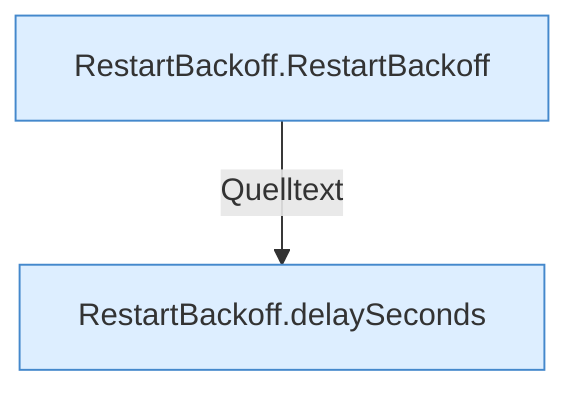

[[00 Start]] › [[Child-Prozess]] › [[Prozess-Bausteine]] › [[RestartBackoff]]

# RestartBackoff

```mermaid
flowchart TD
  n1["RestartBackoff.RestartBackoff"]:::internal-link
  n2["RestartBackoff.delaySeconds"]:::internal-link
  n1 -->|"Quelltext"| n2
  classDef internal-link fill:#ddeeff,stroke:#4488cc
  classDef befund fill:#f88
```

