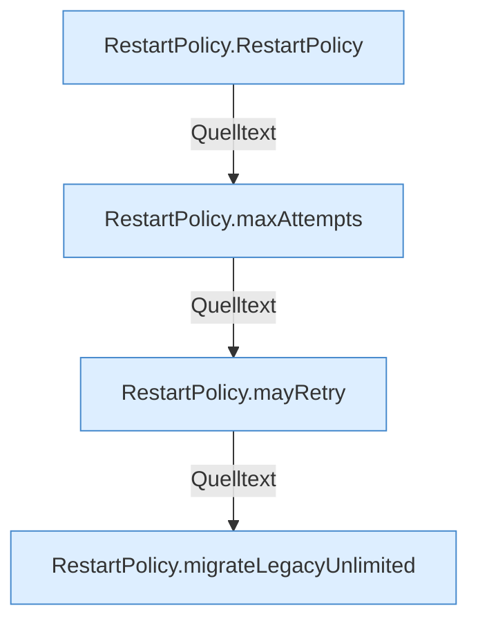

[[00 Start]] › [[Child-Prozess]] › [[Prozess-Bausteine]] › [[RestartPolicy]]

# RestartPolicy

```mermaid
flowchart TD
  n1["RestartPolicy.RestartPolicy"]:::internal-link
  n2["RestartPolicy.maxAttempts"]:::internal-link
  n3["RestartPolicy.mayRetry"]:::internal-link
  n4["RestartPolicy.migrateLegacyUnlimited"]:::internal-link
  n1 -->|"Quelltext"| n2
  n2 -->|"Quelltext"| n3
  n3 -->|"Quelltext"| n4
  classDef internal-link fill:#ddeeff,stroke:#4488cc
  classDef befund fill:#f88
```

