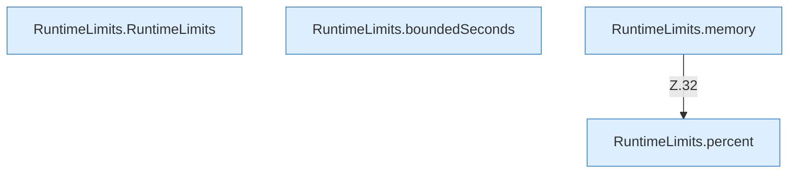

[[00 Start]] › [[Host-Betrieb]] › [[Speicher-Messung]] › [[RuntimeLimits]]

# RuntimeLimits

```mermaid
flowchart TD
  n1["RuntimeLimits.RuntimeLimits"]:::internal-link
  n2["RuntimeLimits.boundedSeconds"]:::internal-link
  n3["RuntimeLimits.memory"]:::internal-link
  n4["RuntimeLimits.percent"]:::internal-link
  n3 -->|"Z.32"| n4
  classDef internal-link fill:#ddeeff,stroke:#4488cc
  classDef befund fill:#f88
```

