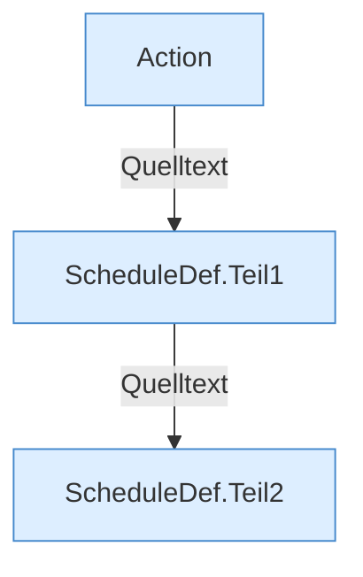

[[00 Start]] › [[Zeitplaene]] › [[Plan-Klassen]] › [[ScheduleDef]]

# ScheduleDef

```mermaid
flowchart TD
  n1["Action"]:::internal-link
  n2["ScheduleDef.Teil1"]:::internal-link
  n3["ScheduleDef.Teil2"]:::internal-link
  n1 -->|"Quelltext"| n2
  n2 -->|"Quelltext"| n3
  classDef internal-link fill:#ddeeff,stroke:#4488cc
  classDef befund fill:#f88
```

