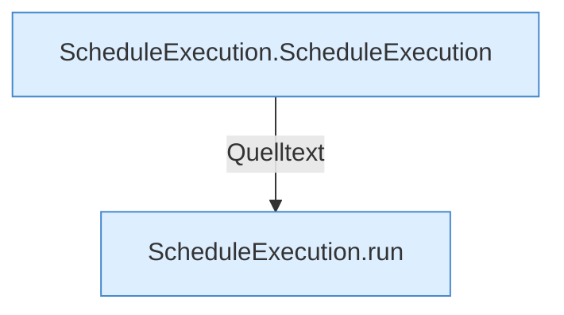

[[00 Start]] › [[Zeitplaene]] › [[Plan-Klassen]] › [[ScheduleExecution]]

# ScheduleExecution

```mermaid
flowchart TD
  n1["ScheduleExecution.ScheduleExecution"]:::internal-link
  n2["ScheduleExecution.run"]:::internal-link
  n1 -->|"Quelltext"| n2
  classDef internal-link fill:#ddeeff,stroke:#4488cc
  classDef befund fill:#f88
```

