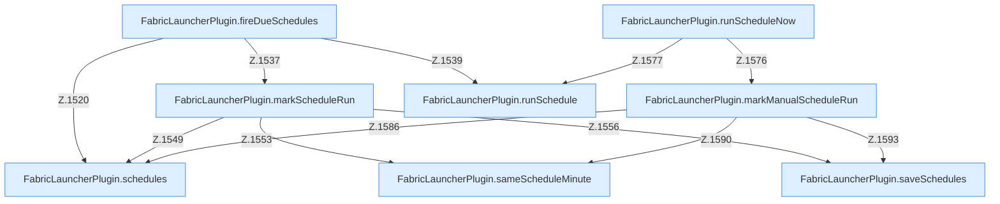

[[00 Start]] › [[Zeitplaene]] › [[Schedules]]

# Schedules

```mermaid
flowchart TD
  n1["FabricLauncherPlugin.schedules"]:::internal-link
  n2["FabricLauncherPlugin.saveSchedules"]:::internal-link
  n3["FabricLauncherPlugin.fireDueSchedules"]:::internal-link
  n4["FabricLauncherPlugin.markScheduleRun"]:::internal-link
  n5["FabricLauncherPlugin.sameScheduleMinute"]:::internal-link
  n6["FabricLauncherPlugin.runScheduleNow"]:::internal-link
  n7["FabricLauncherPlugin.markManualScheduleRun"]:::internal-link
  n8["FabricLauncherPlugin.runSchedule"]:::internal-link
  n3 -->|"Z.1520"| n1
  n3 -->|"Z.1537"| n4
  n3 -->|"Z.1539"| n8
  n4 -->|"Z.1549"| n1
  n4 -->|"Z.1553"| n5
  n4 -->|"Z.1556"| n2
  n6 -->|"Z.1576"| n7
  n6 -->|"Z.1577"| n8
  n7 -->|"Z.1586"| n1
  n7 -->|"Z.1590"| n5
  n7 -->|"Z.1593"| n2
  classDef internal-link fill:#ddeeff,stroke:#4488cc
  classDef befund fill:#f88
```

