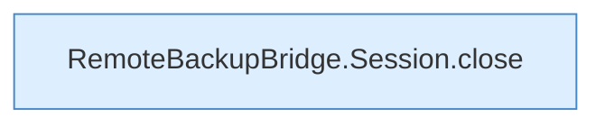

[[00 Start]] › [[Backup]] › [[Backup-Bruecken]] › [[RemoteBackupBridge]] › [[Session]]

# Session


```mermaid
flowchart TD
  n1["RemoteBackupBridge.Session.close"]:::internal-link
  classDef internal-link fill:#ddeeff,stroke:#4488cc
  classDef befund fill:#f88
```

```knoten
RemoteBackupBridge.Session.close
  Schließt `close`. Ruft `replyError`.
```


