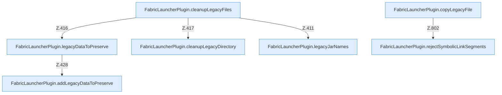

[[00 Start]] › [[Plugin-Kern]] › [[Setup]] › [[Setup-Aufraeumen]]

# Setup-Aufraeumen

```mermaid
flowchart TD
  n1["FabricLauncherPlugin.cleanupLegacyFiles"]:::internal-link
  n2["FabricLauncherPlugin.legacyDataToPreserve"]:::internal-link
  n3["FabricLauncherPlugin.addLegacyDataToPreserve"]:::internal-link
  n4["FabricLauncherPlugin.cleanupLegacyDirectory"]:::internal-link
  n5["FabricLauncherPlugin.legacyJarNames"]:::internal-link
  n6["FabricLauncherPlugin.copyLegacyFile"]:::internal-link
  n7["FabricLauncherPlugin.rejectSymbolicLinkSegments"]:::internal-link
  n1 -->|"Z.411"| n5
  n1 -->|"Z.416"| n2
  n1 -->|"Z.417"| n4
  n2 -->|"Z.428"| n3
  n6 -->|"Z.802"| n7
  classDef internal-link fill:#ddeeff,stroke:#4488cc
  classDef befund fill:#f88
```

