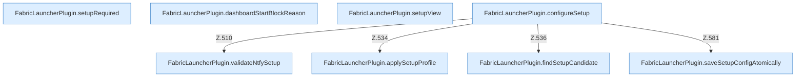

[[00 Start]] › [[Plugin-Kern]] › [[Setup]] › [[Setup-Dialog]]

# Setup-Dialog

```mermaid
flowchart TD
  n1["FabricLauncherPlugin.setupRequired"]:::internal-link
  n2["FabricLauncherPlugin.dashboardStartBlockReason"]:::internal-link
  n3["FabricLauncherPlugin.setupView"]:::internal-link
  n4["FabricLauncherPlugin.configureSetup"]:::internal-link
  n5["FabricLauncherPlugin.saveSetupConfigAtomically"]:::internal-link
  n6["FabricLauncherPlugin.validateNtfySetup"]:::internal-link
  n7["FabricLauncherPlugin.findSetupCandidate"]:::internal-link
  n8["FabricLauncherPlugin.applySetupProfile"]:::internal-link
  n4 -->|"Z.510"| n6
  n4 -->|"Z.534"| n8
  n4 -->|"Z.536"| n7
  n4 -->|"Z.581"| n5
  classDef internal-link fill:#ddeeff,stroke:#4488cc
  classDef befund fill:#f88
```

